**<h1 style="text-align: center">Construção de Páginas Web III   
Lista 01</h1>**

## **Comandos necessários**

Para iniciar o projeto com o nodejs: 
`npm init -y`

Instalar o express 
`npm i express`

## **Parte 1 - Conceitos iniciais de Node.js, NPM e Express**

**1. Explique com suas palavras o que é Node.js e qual é sua função em uma aplicação web.**

R: O Node.js é um ambiente que executa Javascript sem ser no navegador, de forma gratuita, sendo de código aberto e multiplataforma, permitindo os desenvolvedores criar servidores, aplicações web, ferramentas de linha de comando e scripts.

**2. Qual é a diferença principal entre executar JavaScript no navegador e executar JavaScript com Node.js?**

R: O que muda é o ambiente de execução e as APIs disponíveis. No navegador o foco é em páginas web, já o Node.js o foco é em servidores, scripts e ferramentas de sistema.

**3. Explique o que é NPM.**

R: NPM (Node Package Manager) é o gerenciador de pacotes oficial do Node.js. Ele serve para instalar, compartilhar e gerenciar bibliotecas de JavaScript.

**4. Explique a função do arquivo package.json.**

R: É o arquivo de configuração principal de um projeto Node.js. Nele é dito o que o projeto é, do que depende, como executá-lo e como publicá-lo. Sem ele, o npm não saberia o que instalar nem como rodar seus scripts.

**5. Explique por que a pasta node_modules normalmente não é enviada para o GitHub.**

R: Ao baixar algumas bibliotecas com o NPM, essas bibliotecas tem depêndencias que também são baixadas, o que faz com que a pasta node_modules fique pesada com muitos arquivos, e por isso não é muito ideal subir para o Github.

**6. Crie um novo projeto Node.js utilizando npm init -y.**

`npm init -y`

**7. Instale o Express no projeto.**

`npm i express`

**8. Crie o arquivo server.js e importe/configure o Express. + 9. Configure o servidor para escutar na porta 3000.**

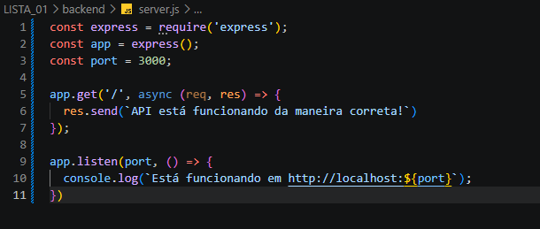

**10. Crie a rota GET / que retorne uma mensagem informando que a API está funcionando. Teste GET / no Postman e registre o resultado no README.**

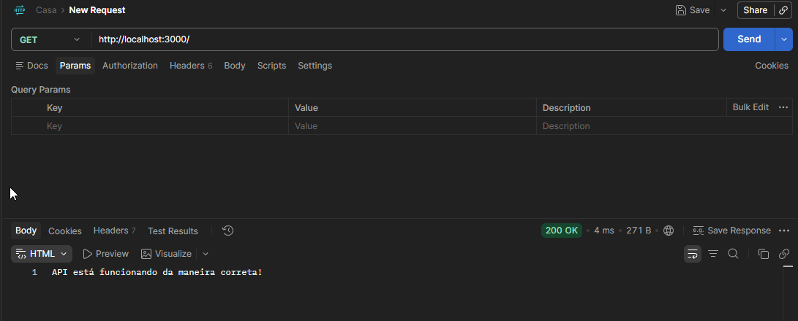

## **Parte 2 - Rotas, requisições e respostas**

**11. Explique o que é uma rota (endpoint) em uma API.**

R: Uma rota (ou endpoint) é uma URL específica de uma API que representa um recurso ou uma ação disponível. Ela define o caminho (ex: /usuarios), o método HTTP aceito (GET, POST, etc.) e a função que será executada quando aquela combinação for acessada.

**12. Explique a função de req em uma rota Express.**

R: req (request) é o objeto que representa a requisição HTTP feita pelo cliente. Ele contém todas as informações enviadas na chamada.

**13. Explique a função de res em uma rota Express.**

R: res (response) é o objeto que representa a resposta que o servidor enviará ao cliente. Ele permite definir status code, cabeçalhos e o corpo da resposta.

**14. Explique a diferença entre res.send() e res.json().**

R: res.send(): envia uma resposta genérica. Pode enviar strings, buffers, objetos ou arrays. Se receber um objeto, o Express o converte para JSON automaticamente, mas o Content-Type pode variar.

res.json(): envia explicitamente uma resposta em formato JSON, definindo o cabeçalho Content-Type: application/json.

**15. Explique o significado de API REST ou RESTful dentro do conteúdo trabalhado.**

R: REST (Representational State Transfer) é um estilo arquitetural para APIs que utiliza os princípios do protocolo HTTP. No conteúdo trabalhado, significa construir APIs organizadas em torno de recursos (ex: usuários, produtos), usando rotas e métodos HTTP de forma padronizada.

**16. Associe cada método HTTP à sua finalidade: GET, POST, PUT e DELETE.**

R: GET: ler/consultar dados de um recurso (ex: listar usuários).

POST: criar um novo recurso (ex: cadastrar um usuário).

PUT: atualizar/substituir um recurso existente (ex: editar todos os dados de um usuário).

DELETE: remover um recurso (ex: excluir um usuário).

**17. Explique a diferença entre req.body e req.params.**

R: req.params: contém os parâmetros de rota, definidos na própria URL da rota (ex: /usuarios/:id → req.params.id). São usados para identificar um recurso específico.

req.body: contém os dados enviados no corpo (body) da requisição, geralmente em requisições POST ou PUT (ex: dados de um formulário ou JSON). É usado para enviar informações mais complexas, como os campos de um novo usuário.

**18. Explique para que serve app.use(express.json()).**

R: Serve para habilitar o middleware que analisa (parse) o corpo das requisições que chegam no formato JSON. Sem ele, o Express não consegue interpretar automaticamente o JSON enviado pelo cliente, e req.body ficaria vazio ou indefinido.

## **Parte 3 - Estrutura inicial de dados**

**19. Crie inicialmente um array chamado jogos contendo pelo menos 3 objetos. Cada jogo deverá possuir: id, titulo, genero, ano e nota.**

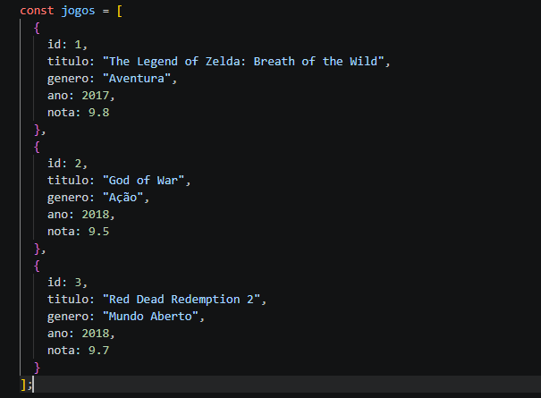

**20. Crie GET /jogos para retornar todos os jogos.**

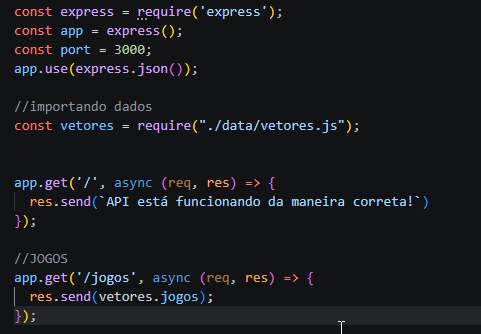

**21. Teste GET /jogos no Postman.**

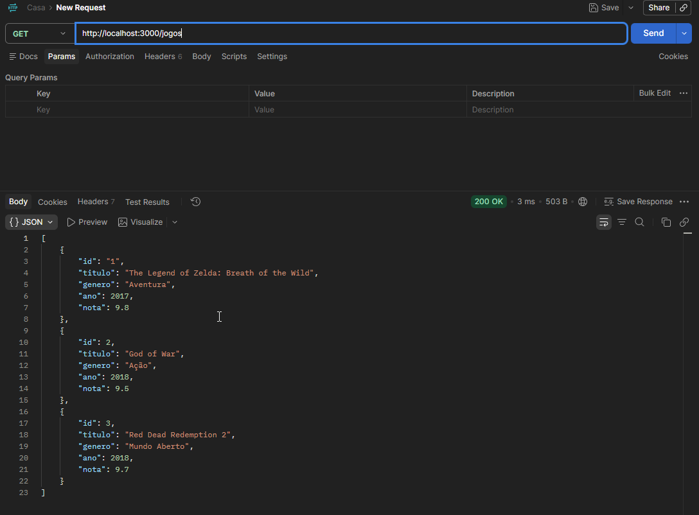

**22. Crie GET /jogos/:id para buscar apenas um jogo pelo ID. + 23. Utilize req.params.id para capturar o ID informado na URL. + 24. Utilize find() para localizar o jogo. + 25. Caso o jogo não exista, retorne status 404 e uma mensagem em JSON.**

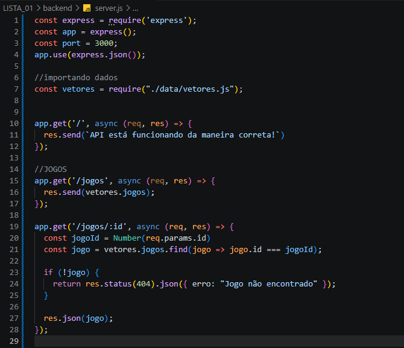

**26. Teste no Postman um ID existente e um ID inexistente. Inclua os dois testes no README.**

**ID EXISTENTE** 
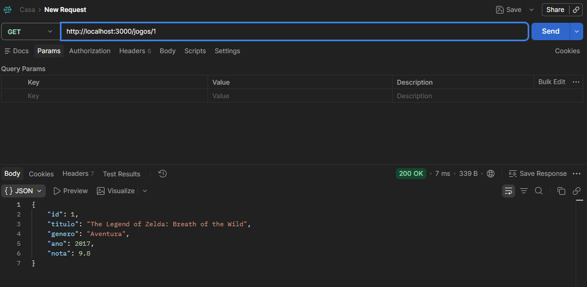

**ID INEXISTENTE** 
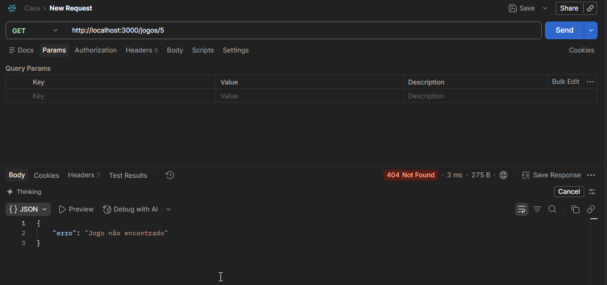

## **Parte 4 - POST: criação de dados**

**27. Crie POST /jogos para cadastrar um novo jogo.**

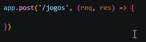

**28. O Body deverá ser enviado pelo Postman no formato JSON. Exemplo: {"titulo":"Minecraft","genero":"Aventura","ano":2011,"nota":9}**

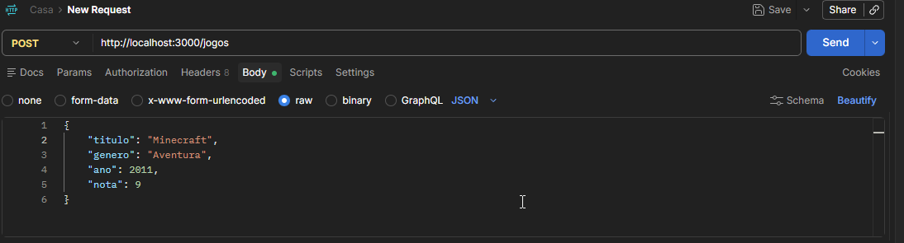

**29. Capture os dados utilizando req.body. + 30. Crie o ID do novo jogo automaticamente. + 31. Adicione o novo objeto ao array utilizando push(). + 32. Caso titulo ou genero não sejam enviados, retorne status 400. +33. Quando o cadastro for realizado corretamente, utilize status 201.**

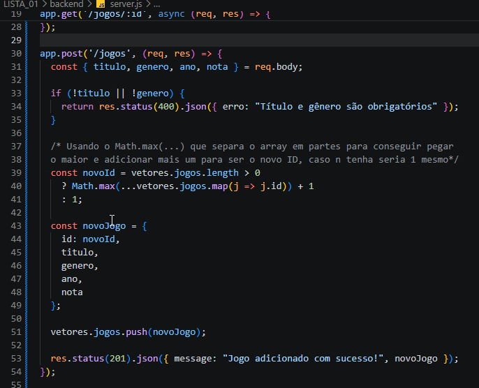

**34. Teste no Postman um POST válido.**

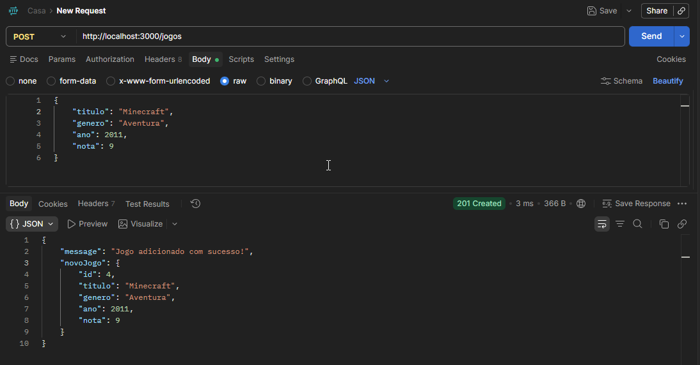

O Array depois de adicionar: 

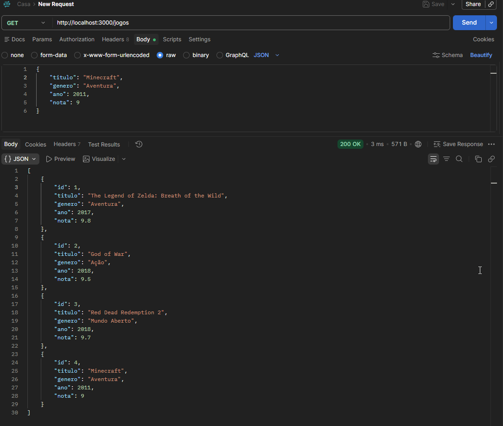

**35. Teste no Postman um POST com dados obrigatórios ausentes. Os prints devem mostrar o Body enviado e a resposta recebida.**

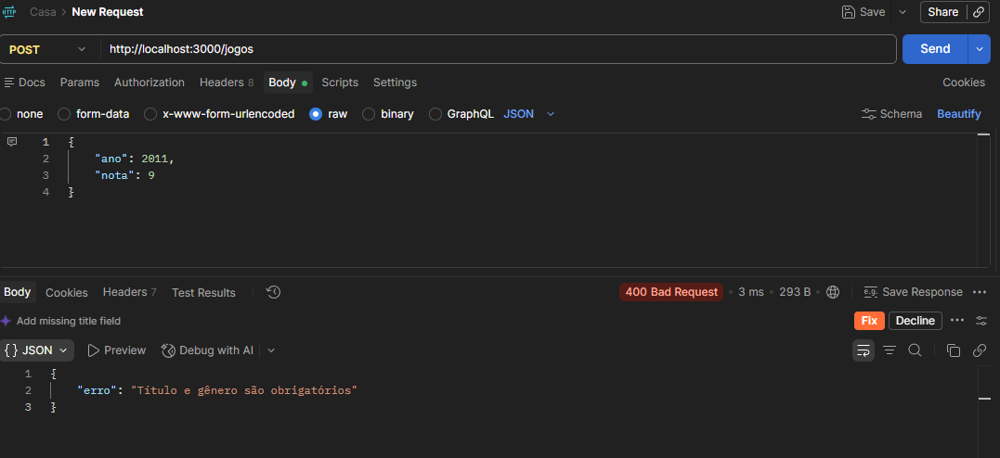

## **Parte 5 - PUT: atualização de dados**
**_
Code by Rogerio Filho
_**
