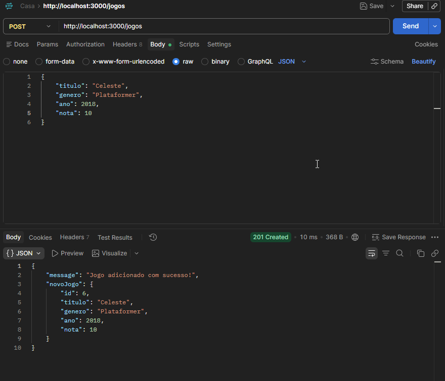
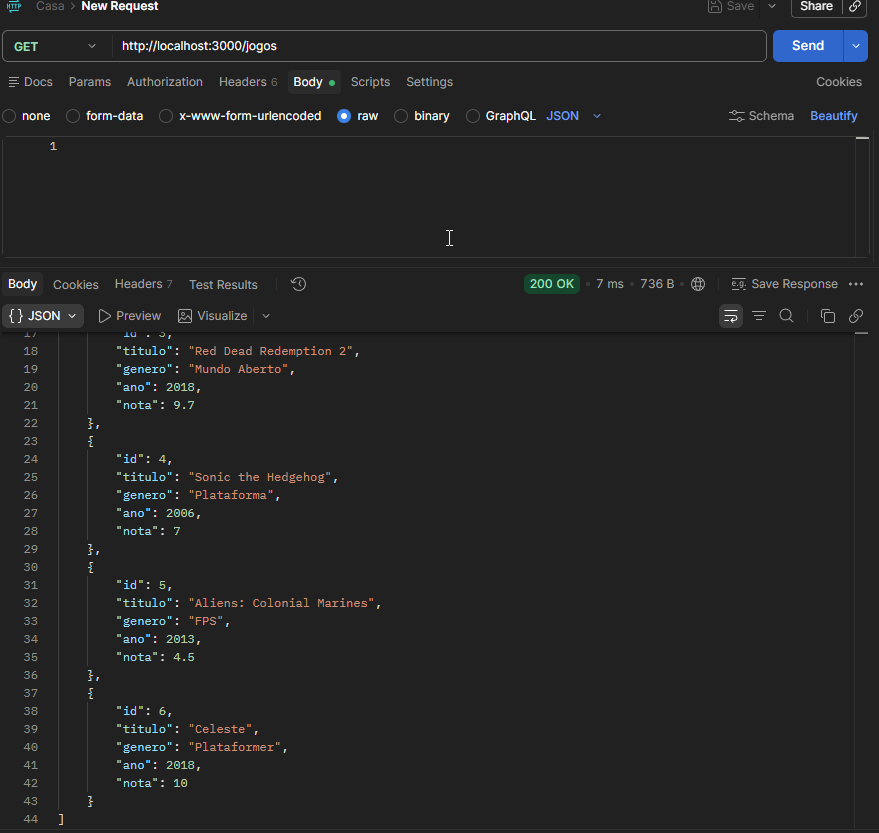
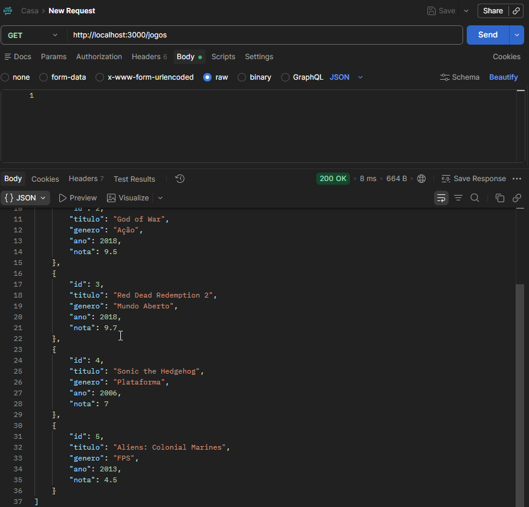
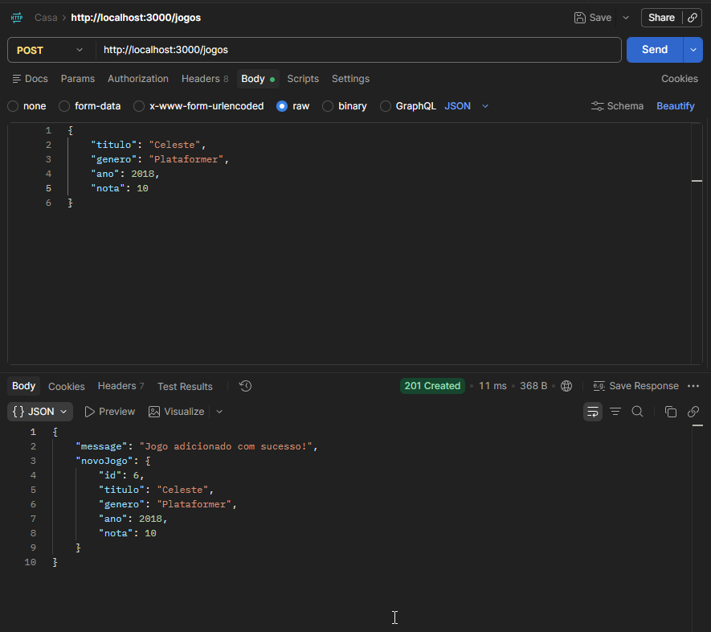
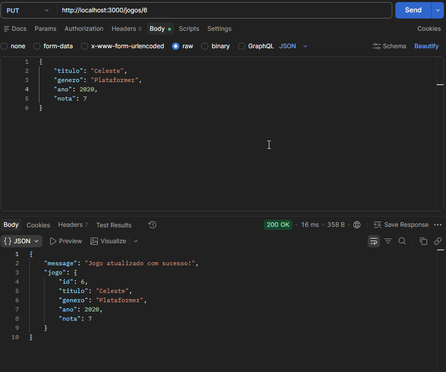
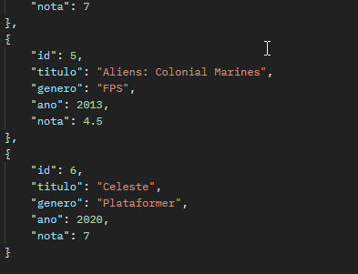
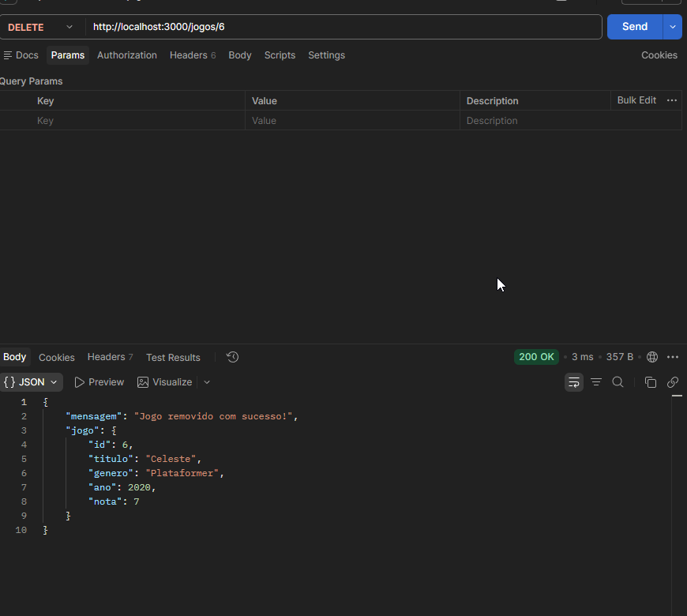
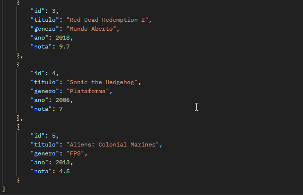
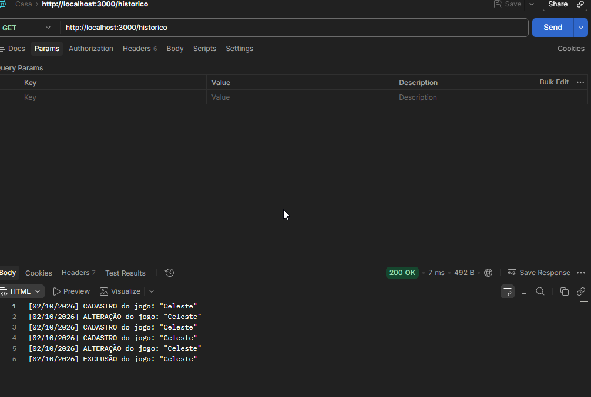

# **
Construção de Páginas Web III    Lista 01
**

## **Comandos necessários**

Para iniciar o projeto com o nodejs: 
`npm init -y`

Instalar o express 
`npm i express`

Para rodar o código e "ligar" o server 
`node server.js`

(opcional) Para não precisar ficar rodando o código o tempo todo instalei o nodemon
como uma dependência de dev 
`npm i nodemon --save-dev`

Rodar com o nodemon 
`npx nodemon server.js`

## **Parte 1 - Conceitos iniciais de Node.js, NPM e Express**

**1. Explique com suas palavras o que é Node.js e qual é sua função em uma aplicação web.**

R: O Node.js é um ambiente que executa Javascript sem ser no navegador, de forma gratuita, sendo de código aberto e multiplataforma, permitindo os desenvolvedores criar servidores, aplicações web, ferramentas de linha de comando e scripts.

**2. Qual é a diferença principal entre executar JavaScript no navegador e executar JavaScript com Node.js?**

R: O que muda é o ambiente de execução e as APIs disponíveis. No navegador o foco é em páginas web, já o Node.js o foco é em servidores, scripts e ferramentas de sistema.

**3. Explique o que é NPM.**

R: NPM (Node Package Manager) é o gerenciador de pacotes oficial do Node.js. Ele serve para instalar, compartilhar e gerenciar bibliotecas de JavaScript.

**4. Explique a função do arquivo package.json.**

R: É o arquivo de configuração principal de um projeto Node.js. Nele é dito o que o projeto é, do que depende, como executá-lo e como publicá-lo. Sem ele, o npm não saberia o que instalar nem como rodar seus scripts.

**5. Explique por que a pasta node_modules normalmente não é enviada para o GitHub.**

R: Ao baixar algumas bibliotecas com o NPM, essas bibliotecas tem depêndencias que também são baixadas, o que faz com que a pasta node_modules fique pesada com muitos arquivos, e por isso não é muito ideal subir para o Github.

**6. Crie um novo projeto Node.js utilizando npm init -y.**

`npm init -y`

**7. Instale o Express no projeto.**

`npm i express`

**8. Crie o arquivo server.js e importe/configure o Express. + 9. Configure o servidor para escutar na porta 3000.**

**10. Crie a rota GET / que retorne uma mensagem informando que a API está funcionando. Teste GET / no Postman e registre o resultado no README.**

## **Parte 2 - Rotas, requisições e respostas**

**11. Explique o que é uma rota (endpoint) em uma API.**

R: Uma rota (ou endpoint) é uma URL específica de uma API que representa um recurso ou uma ação disponível. Ela define o caminho (ex: /usuarios), o método HTTP aceito (GET, POST, etc.) e a função que será executada quando aquela combinação for acessada.

**12. Explique a função de req em uma rota Express.**

R: req (request) é o objeto que representa a requisição HTTP feita pelo cliente. Ele contém todas as informações enviadas na chamada.

**13. Explique a função de res em uma rota Express.**

R: res (response) é o objeto que representa a resposta que o servidor enviará ao cliente. Ele permite definir status code, cabeçalhos e o corpo da resposta.

**14. Explique a diferença entre res.send() e res.json().**

R: res.send(): envia uma resposta genérica. Pode enviar strings, buffers, objetos ou arrays. Se receber um objeto, o Express o converte para JSON automaticamente, mas o Content-Type pode variar.

res.json(): envia explicitamente uma resposta em formato JSON, definindo o cabeçalho Content-Type: application/json.

**15. Explique o significado de API REST ou RESTful dentro do conteúdo trabalhado.**

R: REST (Representational State Transfer) é um estilo arquitetural para APIs que utiliza os princípios do protocolo HTTP. No conteúdo trabalhado, significa construir APIs organizadas em torno de recursos (ex: usuários, produtos), usando rotas e métodos HTTP de forma padronizada.

**16. Associe cada método HTTP à sua finalidade: GET, POST, PUT e DELETE.**

R: GET: ler/consultar dados de um recurso (ex: listar usuários).

POST: criar um novo recurso (ex: cadastrar um usuário).

PUT: atualizar/substituir um recurso existente (ex: editar todos os dados de um usuário).

DELETE: remover um recurso (ex: excluir um usuário).

**17. Explique a diferença entre req.body e req.params.**

R: req.params: contém os parâmetros de rota, definidos na própria URL da rota (ex: /usuarios/:id → req.params.id). São usados para identificar um recurso específico.

req.body: contém os dados enviados no corpo (body) da requisição, geralmente em requisições POST ou PUT (ex: dados de um formulário ou JSON). É usado para enviar informações mais complexas, como os campos de um novo usuário.

**18. Explique para que serve app.use(express.json()).**

R: Serve para habilitar o middleware que analisa (parse) o corpo das requisições que chegam no formato JSON. Sem ele, o Express não consegue interpretar automaticamente o JSON enviado pelo cliente, e req.body ficaria vazio ou indefinido.

## **Parte 3 - Estrutura inicial de dados**

**19. Crie inicialmente um array chamado jogos contendo pelo menos 3 objetos. Cada jogo deverá possuir: id, titulo, genero, ano e nota.**

**20. Crie GET /jogos para retornar todos os jogos.**

**21. Teste GET /jogos no Postman.**

**22. Crie GET /jogos/:id para buscar apenas um jogo pelo ID. + 23. Utilize req.params.id para capturar o ID informado na URL. + 24. Utilize find() para localizar o jogo. + 25. Caso o jogo não exista, retorne status 404 e uma mensagem em JSON.**

**26. Teste no Postman um ID existente e um ID inexistente. Inclua os dois testes no README.**

**ID EXISTENTE** 

**ID INEXISTENTE** 

## **Parte 4 - POST: criação de dados**

**27. Crie POST /jogos para cadastrar um novo jogo.**

**28. O Body deverá ser enviado pelo Postman no formato JSON. Exemplo: {"titulo":"Minecraft","genero":"Aventura","ano":2011,"nota":9}**

**29. Capture os dados utilizando req.body. + 30. Crie o ID do novo jogo automaticamente. + 31. Adicione o novo objeto ao array utilizando push(). + 32. Caso titulo ou genero não sejam enviados, retorne status 400. +33. Quando o cadastro for realizado corretamente, utilize status 201.**

**34. Teste no Postman um POST válido.**

O Array depois de adicionar: 

**35. Teste no Postman um POST com dados obrigatórios ausentes. Os prints devem mostrar o Body enviado e a resposta recebida.**

## **Parte 5 - PUT: atualização de dados**

**36. Crie PUT /jogos/:id. + 37. Localize o jogo utilizando o ID recebido por req.params. + 38. Permita alterar titulo, genero, ano e nota por meio do Body JSON. + 39. Caso o jogo não exista, retorne status 404. + 40. Retorne o objeto atualizado após a alteração.**

**41. Teste no Postman uma atualização válida.**

O Array depois da atualização: 

**42. Teste uma tentativa de atualização utilizando um ID inexistente.**

**43. Explique por que o PUT é diferente do POST.**

R: O PUT diferente do POST serve para substituir ou atualizar um ou mais dados de um recurso já criado. Já o POST serve para criar um novo recurso.

## **Parte 6 - DELETE: exclusão de dados**

**44. Crie DELETE /jogos/:id. + 45. Utilize findIndex() para localizar a posição do jogo no array. + 46. Utilize splice() para remover o jogo. + 47. Caso o ID não exista, retorne status 404. + 48. Retorne uma mensagem confirmando a exclusão.**

**49. Teste o DELETE no Postman.**

**50. Explique por que, neste caso, o DELETE não precisa receber Body.**

R: O DELETE não precisa receber o body, porque a informação necessária para saber qual dos objetos deletar, nesse caso, vem na URL, por isso não há necessidade de chamar o body.

**51. Depois da exclusão, faça um GET /jogos e comprove que o item foi removido.**

Depois de Deletar: 

## **Parte 7 - Rota especial e manipulação de arrays**

**52. Crie GET /jogos/melhores. + 53. Essa rota deverá retornar apenas jogos com nota maior ou igual a 8. + 54. Utilize filter() para realizar a seleção.**

**55. Teste a rota no Postman.**

Para conseguir exemplificar bem adicionei dois itens a mais no array que tem nota
abaixo de 8.

NOVO ARRAY BASE: 

Teste: 

**56. Explique a diferença entre find(), findIndex() e filter().**

R: find(): Retorna o primeiro elemento que satisfaz a condição. Se nenhum for encontrado, retorna undefined.

findIndex(): Retorna o índice do primeiro elemento que satisfaz a condição. Se nenhum for encontrado, retorna -1.

filter(): Retorna um novo array com todos os elementos que satisfazem a condição. Se nenhum for encontrado, retorna um array vazio [].

**57. Explique a diferença entre push() e splice().**

R: push(): Adiciona um ou mais elementos no final do array e retorna o novo comprimento do array. Não remove nada.

splice(): É um método que pode adicionar, remover ou substituir elementos em qualquer posição do array. Retorna um array com os elementos removidos (ou vazio, se nada foi removido). Modifica o array original.

## **Parte 8 - JSON: teoria e conversão**

**58. Explique o que é JSON.**

R: JSON (JavaScript Object Notation) é um formato leve de intercâmbio de dados, baseado em texto, usado para representar dados estruturados. Um JSON é composto por pares chave-valor, arrays, strings, números, booleanos e null.

**59. Explique a função de JSON.parse().**

R: JSON.parse() converte uma string no formato JSON em um objeto ou valor JavaScript correspondente.

**60. Explique a função de JSON.stringify().**

R: JSON.stringify() faz o oposto: converte um objeto ou valor JavaScript em uma string no formato JSON.

**61. Explique por que um arquivo JSON armazenado no disco precisa ser lido como texto antes de ser manipulado como objeto/array JavaScript.**

R: Um arquivo no disco é apenas uma sequência de bytes. O conteúdo JSON é texto puro, não um objeto em memória. O JavaScript não acessa diretamente o disco como se fosse memória; é preciso ler o arquivo (geralmente com fs.readFile no Node.js ou fetch no navegador), obtendo uma string.

**62. Explique a finalidade dos parâmetros null, 2 em JSON.stringify(dados, null, 2).**

R: O primeiro parâmetro (dados) é o valor a ser convertido.

O segundo parâmetro (null) é o replacer, que permite filtrar ou transformar propriedades. null significa que nenhuma filtragem/transformação será feita.

O terceiro parâmetro (2) é o space, que define a indentação. Com 2, a saída fica formatada com 2 espaços por nível, tornando o JSON legível.

**63. Identifique pelo menos três regras de sintaxe de um JSON válido.**

R: As chaves (nomes de propriedades) devem estar entre aspas duplas. As strings devem usar aspas duplas (não aspas simples).
Não é permitido vírgula após o último elemento de um objeto ou array.

**64. Explique a diferença entre um objeto JavaScript em memória e o texto armazenado em um arquivo .json.**

R: Um objeto JavaScript em memória é uma estrutura viva, com propriedades e métodos, que pode ser manipulada diretamente. Já o texto em um arquivo .json é apenas uma representação serializada, estática e legível, sem comportamento.

## **Parte 9 - Persistência em arquivo JSON**

**65. Crie uma pasta dados e, dentro dela, o arquivo jogos.json.**

**66. Transfira os jogos iniciais para jogos.json.**

**67. Leia o conteúdo de jogos.json utilizando o módulo fs.**

**68. Converta o conteúdo lido utilizando JSON.parse().**

**69. Faça GET /jogos retornar os dados lidos do arquivo, em vez de depender somente de um array criado diretamente no server.js.**

**70. No POST /jogos, leia o arquivo, faça JSON.parse(), adicione o novo jogo com push(), converta novamente com JSON.stringify() e grave o arquivo.**

**71. Depois de cadastrar um jogo pelo Postman, reinicie o servidor e comprove que o jogo continua cadastrado.**

Cadastro: 

Depois de fechar e abrir o servidor: 

**72. Explique por que os dados agora permanecem após o servidor ser desligado.**

R: Antes, os jogos ficavam apenas em um array na memória RAM (vetores.jogos). A memória RAM é volátil: quando o processo Node.js é encerrado tudo que estava nela é descartado. Por isso, ao reiniciar o servidor, o array voltava ao estado inicial definido no server.js. Agora, os dados persistem porque passaram a ser gravados em disco, que é um meio de armazenamento não volátil.

**73. Adapte o PUT para que a alteração também seja salva em jogos.json.**

**74. Adapte o DELETE para que a exclusão também seja salva em jogos.json.**

**75. Teste novamente GET, POST, PUT e DELETE no Postman após implementar a persistência. Os dados do arquivo jogos.json deverão realmente mudar após as operações.**

Deletei o celeste novamente para testar com o mesmo jogo...

GET: 

POST: 

PUT: 

Prova que mudou do PUT: 

DELETE: 

Prova que realmente deletou: 

## **Parte 10 - Manipulação de arquivo TXT e histórico**

**76. Crie o arquivo historico.txt.**

**77. Sempre que um jogo for cadastrado, acrescente uma linha no histórico Formato sugerido: JOGO CADASTRADO: Minecraft**

**78. Sempre que um jogo for atualizado, acrescente uma linha informando a atualização.**

**79. Sempre que um jogo for removido, acrescente uma linha informando a remoção.**

**80. Utilize appendFile ou appendFileSync para acrescentar dados sem apagar o conteúdo anterior.**

**81. Crie GET /historico para ler e retornar o conteúdo de historico.txt.**

**82. Teste GET /historico no Postman.**

**83. Explique a diferença entre writeFile e appendFile.**

R: writeFile grava conteúdo em um arquivo substituindo tudo o que já existia nele. Se o arquivo não existir, ele é criado; se existir, seu conteúdo anterior é apagado e trocado pelo novo.

appendFile grava conteúdo adicionando ao final do arquivo, preservando o que já estava lá. Se o arquivo não existir, ele também é criado.

**84. Explique o que pode acontecer com o conteúdo anterior de um arquivo quando writeFile é utilizado sobre um arquivo que já existe.**

R: Quando writeFile é usado sobre um arquivo existente, todo o conteúdo anterior é apagado e substituído pelo novo conteúdo. Não há mesclagem nem preservação: o arquivo é tratado como se fosse zerado antes da escrita.

**85. Explique a finalidade de readFile.**

R: A finalidade de readFile é ler o conteúdo de um arquivo do disco e disponibilizá-lo ao programa, geralmente como texto

## **Parte 11 - Exclusão de arquivos e módulo fs**

**86. Explique a função de fs.unlink().**

R: fs.unlink() é o método do módulo fs do Node.js usado para excluir (remover) um arquivo do sistema de arquivos.

**87. Explique o que acontece quando fs.unlink() é usado para remover um arquivo.**

R: O link entre o diretório e o arquivo é removido. Se não houver mais nenhum link/handle apontando para esse arquivo (o caso comum), o conteúdo do arquivo é apagado do disco e o espaço é liberado. O arquivo deixa de existir — não aparece mais em listagens (ls, dir) e não pode mais ser aberto para leitura ou escrita.

**88. Associe as operações abaixo aos métodos de arquivo correspondentes: criar/escrever, ler, acrescentar e excluir.**

R: Criar / escrever (sobrescrevendo) = fs.writeFile()
Ler = fs.readFile()
Acrescentar (adicionar ao final) = fs.appendFile()
Excluir = fs.unlink()

**89. Explique o que significa o erro ENOENT.**

R: ENOENT é a abreviação de "Error NO ENTry" (erro: nenhuma entrada). É o código de erro retornado pelo sistema operacional quando se tenta acessar um arquivo ou diretório que não existe.

**90. Cite uma situação do projeto em que ENOENT poderia ocorrer.**

R: Situação - arquivo jogos.json ainda não existe:

Se o servidor iniciar e alguém fizer GET /jogos antes de dados/jogos.json ter sido criado (por exemplo, você apagou a pasta dados ou esqueceu de criar o arquivo), a chamada fs.readFileSync(CAMINHO, 'utf-8') dentro de lerJogos() lançaria:

`Error: ENOENT: no such file or directory, open '.../dados/jogos.json'`

## **Parte 12 - path e caminhos de arquivos**

**91. Explique para que serve o módulo path do Node.js.**

R: O módulo path é um módulo nativo do Node.js que serve para manipular e construir caminhos de arquivos e diretórios de forma segura e portável. Ele oferece funções utilitárias para juntar, normalizar, resolver, extrair partes e comparar caminhos, levando em conta as diferenças de cada sistema operacional.

**92. Explique por que escrever caminhos manualmente pode causar problemas entre Windows, Linux e macOS.**

R: Porque cada sistema operacional usa convenções diferentes para representar caminhos e com isso o código pode não funcionar em SOs diferentes. Para não deixar isso acontecer o path abstrai essas diferenças e gera o caminho no formato correto para o SO em que o código está rodando.

Escrever caminhos manualmente é frágil porque:

1. o separador de pastas muda entre SOs;
2. caminhos absolutos têm formato diferente;
3. Linux diferencia maiúsculas e Windows não;
4. caracteres proibidos variam;
5. caminhos relativos dependem do diretório de execução;

Usar path.join e \_\_dirname elimina essas diferenças e torna o código portável, funcionando igual no Windows, Linux e macOS — que é exatamente o que um projeto Node.js precisa para rodar tanto na máquina do dev quanto no servidor de produção.

**93. Utilize path.join() para montar o caminho de jogos.json.**

**94. Utilize path.join() para montar o caminho de historico.txt.**

**95. Explique a vantagem de utilizar path.join() no projeto.**

R: path.join() junta os segmentos de caminho usando o separador nativo do sistema operacional e normaliza o resultado (remove barras duplicadas, resolve . e ..)

1. Portabilidade entre sistemas: O mesmo código funciona nos três SOs, sem alterações.

2. Evita erros de separador: Você não precisa se preocupar se deve usar \ ou /. O path.join escolhe o correto automaticamente.

3. Uso de **dirname como ponto de partida: **dirname é o diretório do arquivo atual (server.js). Isso garante que o caminho seja resolvido a partir da localização do projeto, não do diretório de onde o Node foi executado. Sem isso, rodar node src/server.js de pastas diferentes poderia levar a caminhos errados e erros ENOENT.

4. Código mais limpo e legível

## **Parte 13 - Tratamento de erros**

**96. Explique a função do bloco try/catch.**

R: O bloco try/catch é a estrutura do JavaScript usada para tratar erros de forma controlada, evitando que uma exceção interrompa a execução do programa de forma abrupta. Ele permite que o código "tente" executar algo potencialmente perigoso e, se der errado, "capture" o erro e decida o que fazer com ele.

**97. Implemente tratamento de erro em pelo menos uma operação de leitura de arquivo.**

**98. Implemente tratamento de erro em pelo menos uma operação de escrita de arquivo.**

**99. Caso ocorra um erro interno inesperado em uma rota, retorne uma resposta de erro apropriada ao cliente.**

**100. Teste uma situação de erro controlado e descreva no README o que aconteceu.**

**Cenário**: arquivo `jogos.json` inexistente

Para verificar se o servidor trata a ausência do arquivo de dados sem cair,
foi realizado o seguinte teste:

Com o servidor em execução, o arquivo `dados/jogos.json` foi apagado manualmente.

Em seguida, foi feita a requisição:

`GET http://localhost:3000/jogos`

Resultado observado:

_Resposta da API: [] (array vazio), com status HTTP 200._

Terminal do servidor:

`jogos.json não existe. Criando arquivo vazio...`

Arquivo recriado automaticamente: ao inspecionar dados/jogos.json,
seu conteúdo era [].

Servidor continuou no ar: um POST /jogos logo em seguida cadastrou
um novo jogo normalmente, gravando-o no arquivo recém-criado.

## **Parte 14 - Síncrono, assíncrono e Event Loop**

101. Explique a diferença entre uma operação síncrona e uma operação assíncrona.
102. Explique o que acontece com o servidor quando uma operação síncrona demorada
     bloqueia a execução.
103. Explique, de acordo com o conteúdo trabalhado, por que operações assíncronas são preferíveis em rotas de servidor.
104. Explique o que é uma Promise.
105. Explique a função de async.
106. Explique a função de await.
107. Compare readFileSync com readFile.
108. Se utilizar a versão assíncrona no projeto, envolva a operação em try/catch.

## **Parte 15 - Middlewares**

109. Explique o que é um middleware no Express.
110. Explique por que express.json() pode ser considerado um middleware.
111. Cite duas outras responsabilidades que um middleware pode assumir em uma aplicação.
112. Explique em que momento o middleware atua no fluxo requisição -> rota -> resposta.

## **Parte 16 - Sessões e Cookies - SOMENTE TEORIA**

_Nesta parte não é necessário instalar bibliotecas nem implementar login, sessão ou cookie. Responda somente com base nos conceitos estudados._

113. Explique por que o protocolo HTTP é considerado stateless. 114. Explique o que é um Cookie.
114. Explique o que é uma Sessão. 116. Onde os dados de um Cookie ficam armazenados?
115. Onde os dados de uma Sessão ficam armazenados?
116. Explique como Cookie e Sessão podem trabalhar juntos para reconhecer um usuário entre diferentes requisições.
117. Cite um exemplo de uso adequado para Cookie.
118. Cite um exemplo de uso adequado para Sessão.
119. Explique, de forma conceitual, o que é Session ID.

## **Parte 17 - Testes obrigatórios no Postman**

122. Crie no Postman uma requisição para GET /.
123. Crie uma requisição para GET /jogos.
124. Crie uma requisição para GET /jogos/:id.
125. Crie uma requisição para POST /jogos com Body JSON.
126. Crie uma requisição para PUT /jogos/:id com Body JSON.
127. Crie uma requisição para DELETE /jogos/:id.
128. Crie uma requisição para GET /jogos/melhores.
129. Crie uma requisição para GET /historico.
130. Para cada operação principal, registre no README pelo menos um print que mostre a execução.
131. Em POST e PUT, o print deverá mostrar o Body JSON utilizado.
132. Inclua pelo menos um teste que resulte em status 404.
133. Inclua pelo menos um teste que resulte em status 400.
134. Inclua pelo menos um teste que resulte em status 201.
135. Não será considerado suficiente entregar apenas o código sem evidência de execução das rotas.

## **Parte 18 - Organização e entrega**

**136. Organize o projeto de forma clara, separando os arquivos de dados do arquivo principal do servidor.**

Estrutura mínima sugerida: 
server.js 
package.json 
dados/jogos.json 
dados/historico.txt 
README.md

**137. Não envie a pasta node_modules para o repositório. +138. Inclua no README os comandos necessários para instalar as dependências e iniciar o servidor. + 139. Inclua no README as respostas das questões teóricas. + 140. Inclua no README os prints solicitados dos testes no Postman.**

[print da pasta como está]

**141. Envie o link do repositório no GitHub conforme orientação da professora.**

Esse é o link para o repositório que está a Lista 01: 
https://github.com/crosssmart/projetos_CPW3/tree/main

Outro link para ir direto na pasta correta: 
https://github.com/crosssmart/projetos_CPW3/tree/main/LISTA_01

 

**_
Code by Rogerio Filho '-'
_**
